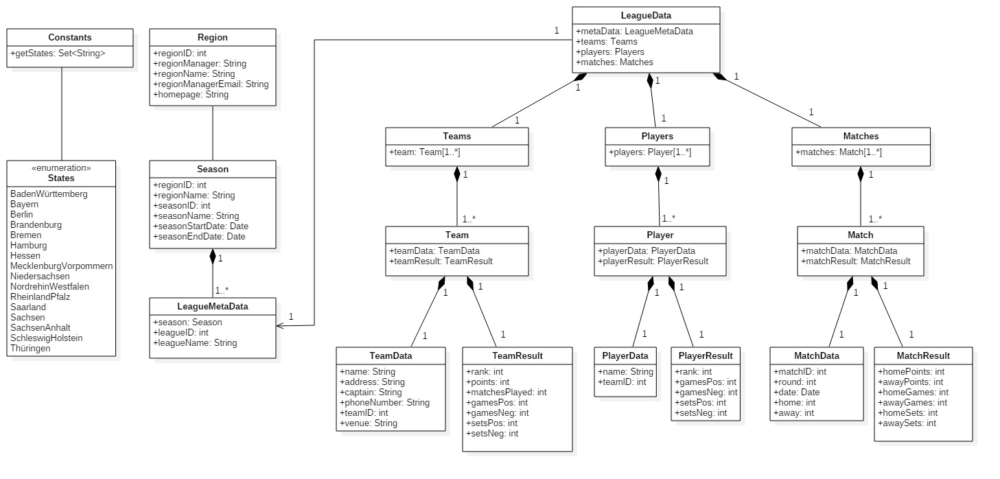

# DSAB data loader

## Introduction
This library can be used to load and parse information from the website of the Deutscher Sportautomatenbund e.V. (DSAB) (http://www.dsab-vfs.de).
The DSAB organizes electronic darts events in Germany. This includes nation-wide tournaments as well as amateur and professional leagues.

The results of the leagues in Germany are published on the DSAB website (http://www.dsab-vfs.de). Multiple websites for regional associations also publish the results within their region.
Usually the information about a certain league and their results require a couple of clicks and data is presented in multiple formats (e.g. HTML and PDF).
The library provided here allows to load the data from the DSAB website, it prepares it and offers it in a structured way. The DSAB website offers the information using REST so that the access is quite easy and can be derived from the information received.

## Source code
The source code of the library is made available on GitHub: https://github.com/senvB/dsabDataLoader
The library is released under the terms of the GNU Affero General Public License (version 3 or later).

#### Dependencies
The code makes use of the following libraries.

- JSON marshalling and unmarshalling
  - com.squareup.moshi:moshi (https://github.com/square/moshi)
- IO utils
  - commons-io:commons-io (https://commons.apache.org/proper/commons-io/)
  - org.apache.commons:commons-lang3 (https://commons.apache.org/proper/commons-lang/)
- HTML parsing
  - org.jsoup:jsoup (https://jsoup.org)
- PDF parsing
  - com.itextpdf:itextg (https://itextpdf.com)
- Logging
  - org.slf4j:slf4j-api (https://www.slf4j.org)
  - org.slf4j:slf4j-simple
- Testing of the code
  - junit:junit:4.12 (https://junit.org)
  - com.tngtech.java:junit-dataprovider (https://github.com/TNG/junit-dataprovider)
  - org.mockito:mockito-all (https://site.mockito.org)
 

## Data model
The data model offered by the library (after parsing the data) is explained in more detail in the GitHub wiki (https://github.com/senvB/dsabDataLoader/wiki/Data-model) and also shown in the images folder.

The model has been created using StarUML ([http://staruml.io/](http://staruml.io/)).

## Android app using this library
It is used to read actual (and past) scores for all Darts leagues maintained by the DSAB. A free android app using this library is available on http://dartsviewer.senv.de. The source code of the app is also offered on GitHub.

## About the author
My name is Sven and I am playing electronic darts as one of my hobbies. This project brings darts in combination with my second hobby: coding. Whenever there is some spare time I try to code a little bit and learn new stuff.
Living currently in Berlin you may also find my name in the players list when using the related Android app.

In case you would like to use the library or the app I would be happy to receive a message from you. Also if you would like to contribute or have a nice idea of a new feature, then please don not hesitate to contact me. This also counts for any kind of bugs you encounter when using my code.``

The website of the app can be found under https://dartsviewer.senv.de. This website is in German.

Any kind of feedback is welcome under <a href="dartsviewerfeedback@senv.de">dartsviewer@senv.de</a>
